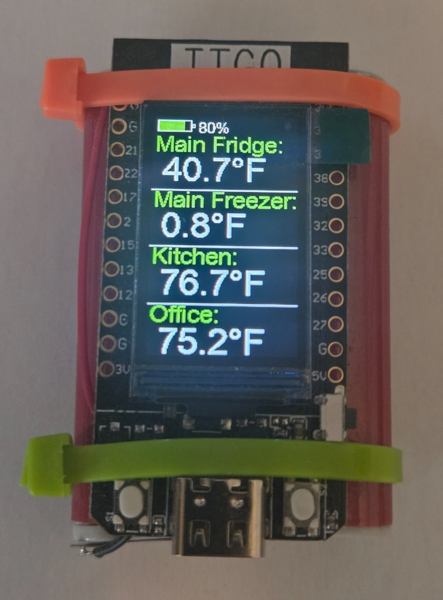

# ESPHome: LilyGO T-Display quad sensor dashboard

**Release 1.4.3** — silent-resume after OTA soft reboot (`ESP_RST_SW`); factory `project.version` aligned (see [CHANGELOG.md](CHANGELOG.md)). When publishing on GitHub, create tag **`v1.4.3`** (see [Releases](https://github.com/shomanjk/ESPhome-Tdisplay-Quad-Sensor/releases)).

Four Home Assistant sensor values on the original **LilyGO T-Display** (ESP32), plus a battery gauge and USB-power indicator. Typical use cases include **refrigerator / freezer / room temperatures** (the demo substitutions), or any four numeric HA entities you prefer.

Prebuilt **factory** firmware is published via GitHub Pages and [ESP Web Tools](https://esphome.github.io/esp-web-tools/) for browser-based install.

## Install prebuilt firmware (web)

1. Connect the T-Display over USB.
2. Open the installer in **Chrome** or **Edge** ([Web Serial](https://developer.mozilla.org/en-US/docs/Web/API/Web_Serial_API); see [ESP Web Tools](https://esphome.github.io/esp-web-tools/)).
3. Flash the firmware, then complete **Improv Serial** Wi‑Fi provisioning in the installer when prompted.
4. In **Home Assistant → ESPHome Device Builder**, **Adopt** the device. That pulls [`lilygoT-Display-QuadSensor.yaml`](lilygoT-Display-QuadSensor.yaml) so you can edit rows and OTA.

Installer URL (clickable on GitHub; copy-paste if needed):

https://shomanjk.github.io/ESPhome-Tdisplay-Quad-Sensor/

That page is built from [`static/index.md`](static/index.md) by the [Publish workflow](.github/workflows/publish.yml) and includes the flash button plus `firmware/manifest.json` — it is **not** this README file.

The web image is built from [`lilygoT-Display-QuadSensor.factory.yaml`](lilygoT-Display-QuadSensor.factory.yaml) (`improv_serial`, `dashboard_import`, MAC-suffixed name). After Adopt, you edit the **core** package (not the factory wrapper).

### After install: customize your four rows

Prebuilt firmware still ships **example** fridge/kitchen entity IDs so the display can demo out of the box on a matching HA setup. For your home:

1. Adopt the device in ESPHome Device Builder.
2. Edit **`label_1`…`label_4`** and **`entity_1`…`entity_4`** (and `unit_of_measurement` / **`deep_sleep_duration`** if needed).
3. Install via OTA.

Until you change those substitutions, rows point at the demo entities in this repo’s YAML.

### If Wi‑Fi must be set again

Use the web installer’s **Improv Serial** again over USB, or join the device **`Fallback_AP`** captive portal when it cannot reach the configured network.

### If github.io shows this whole README but no install button

**GitHub Pages** is almost certainly set to **Deploy from a branch** (for example **Build and deployment → Source: Deploy from a branch → `/ (root)`**). That makes Jekyll build the **repository root**, so the homepage becomes **README.md** and you will not get the [ESP Web Tools](https://esphome.github.io/esp-web-tools/) button or prebuilt binaries under `firmware/`.

**Fix:** **Settings → Pages → Build and deployment → Source:** choose **GitHub Actions**. After the next successful [Publish](.github/workflows/publish.yml) run (every push to `main`, or **Actions → Publish → Run workflow**), `https://<user>.github.io/<repo>/` should show the short **Installation** page with the install button.

If you **forked** this repo, use your own Pages URL once Actions publishing works: `https://<your-username>.github.io/<your-repo-name>/`.

## Requirements

- **Hardware:** Original **LilyGO T-Display** (ESP32). This config has **not** been tested on T-Display *S3* or other variants.
- **ESPHome:** **Pages** and **CI** both compile with **current stable**. Treat **2026.7.3** as the **last explicitly verified** release in this repo; use **stable** locally. Older ESPHome (before the `mipi_spi` T-Display model and stock ADC) will not match this YAML.
- **Home Assistant:** Native API (`api:`). Device name defaults to **`tdisplay-quad-sensor`** (factory builds append a MAC suffix).

## What appears on the display

Four labeled rows (demo defaults: **Main Fridge**, **Main Freezer**, **Kitchen**, **Office** — set via `label_1`…`label_4`) with live values, a **battery** outline with fill and percentage, and a yellow **⚡** when USB power is detected (TTGO T-Display behavior).

## One-click builds and secrets

[`lilygoT-Display-QuadSensor.yaml`](lilygoT-Display-QuadSensor.yaml) uses `!secret wifi_ssid` and `!secret wifi_password` for Wi‑Fi—those are the **only** secrets referenced by the published YAML. Factory builds still need those keys present at **compile** time (CI uses dummies); end users set real Wi‑Fi via **Improv** or the captive portal.

- **Visitors** can flash **prebuilt** firmware from GitHub Pages without a local `secrets.yaml`.
- **CI and Pages** run `cp secrets.yaml.example secrets.yaml` before compile so automation uses **dummy** Wi‑Fi strings.

**Never commit** a real `secrets.yaml` (it is **gitignored**). For local `esphome compile` or the dashboard, copy [`secrets.yaml.example`](secrets.yaml.example) to `secrets.yaml` and set real Wi‑Fi values. The example also lists optional keys (API encryption, OTA, AP password); they take effect only if **you** add matching `!secret` references in your YAML (the public config intentionally keeps API/OTA open for easy prebuilt flashing).

## Instructions

1. Use the **[installer page](#install-prebuilt-firmware-web)** above (Improv Wi‑Fi, then Adopt).
2. **Local builds (core / after adopt):** Copy `secrets.yaml.example` → `secrets.yaml`, set Wi‑Fi, then run `esphome compile lilygoT-Display-QuadSensor.yaml` (or use the ESPHome dashboard). Set `label_*` / `entity_*` substitutions to your Home Assistant entities.
3. **Local factory build** (matches Pages): `esphome compile lilygoT-Display-QuadSensor.factory.yaml`.

### If you fork: enable GitHub Pages

This repo deploys Pages with **GitHub Actions** (see [`.github/workflows/publish.yml`](.github/workflows/publish.yml)), not a `gh-pages` branch. In the fork: **Settings → Pages → Build and deployment → Source:** choose **GitHub Actions**. Update `dashboard_import.package_import_url` in the factory YAML to your fork.

The workflow **builds** firmware and **deploys** to Pages on **every push to `main`**, or when you **manually run** the Publish workflow (**Actions → Publish → Run workflow**) on `main`. Creating a GitHub **Release** does not run Publish; merge or push to `main` (or a manual run) updates the live site.

## Buttons and sleep

With the **USB port at the bottom**, release the button at the **bottom right** (**GPIO35**) to enter **deep sleep** for **`deep_sleep_duration`** (default **24 hours**). Press the same button again to wake for interactive use: backlight on, stay awake until you release the sleep button again.

**Timer wake (default every 24h):** silent check-in — **no backlight**, connect Wi‑Fi/API, publish battery, linger ~**2 minutes** so ESPHome Device Builder **queued offline OTA** can land, then re-sleep. If OTA reboots mid-window, the next boot stays on the silent path (no backlight) until check-in finishes. Cold boot / power-on stays interactive like a button wake.

Low battery (< 30%, and not on USB) waits **3 minutes**, then sleeps for the same duration—never with zero wake sources.

Sleep is entered on **button release** (not press) so the wake pin is inactive when EXT0 is armed. After a button wake, the first release is ignored so the device does not immediately re-sleep.

## Technical notes (forks / maintainers)

- **Factory vs core:** Pages flashes **`.factory.yaml`**; Adopt imports **core** YAML only.
- **Display:** `mipi_spi` / `model: T-DISPLAY`; backlight on **GPIO4** (`output` + `on_boot`). Do not use deprecated `st7789v` on current ESPHome.
- **Deep sleep:** `sleep_duration` comes from substitution **`deep_sleep_duration`**; GPIO35 `wakeup_pin` with `wakeup_pin_mode: IGNORE`.
- **Battery / USB:** `adc` on **GPIO34** with **`samples: 8`**, **`attenuation: 12db`**, and a `multiply` filter for the onboard divider; USB present when VBatt **> 4.25 V**. Fonts: `COPYRIGHT` in the `.bdf` files under `fonts/`; the USB bolt uses **Noto Sans Symbols 2** (`fonts/NotoSansSymbols2-Regular.ttf`, OFL in `fonts/OFL-NotoSansSymbols2.txt`).
- **ESP32 chip / IRAM opts (optional):** Original T-Displays shipped over years with different ESP32 silicon. Defaults leave `esp32.framework.advanced` **unset** so older boards keep working. After a **USB** flash with current ESPHome, boot logs may suggest `minimum_chip_revision: "3.1"` and/or `sram1_as_iram: true` — uncomment those lines in the core YAML or, better, set them in your **local/adopted overlay**. Do not enable them blindly: wrong revision or an old bootloader can prevent boot (USB recover). See commented block under `esp32:` in [`lilygoT-Display-QuadSensor.yaml`](lilygoT-Display-QuadSensor.yaml).

## Other files

- **[CHANGELOG.md](CHANGELOG.md)** — Release history and maintainer notes.
- **[lilygoT-Display-QuadSensor.factory.yaml](lilygoT-Display-QuadSensor.factory.yaml)** — Factory image for web install / Improv / Adopt metadata.
- **[project-template-esp32.yaml](project-template-esp32.yaml)** — Minimal ESP32 + Wi‑Fi template unrelated to the quad display; useful as a starting point for other devices.

Contributions and issue reports are welcome.
